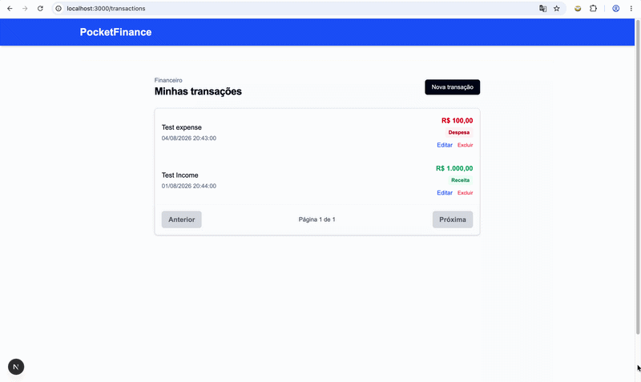

# PocketFinance — Personal Finance Manager

PocketFinance is a full-stack Micro SaaS for personal finance management. Built as an educational project to practice real-world software engineering across the full stack.

---

## Demo



---

## Features

- List transactions with pagination
- Create, edit and delete transactions
- Filter by type (income / expense)
- Responsive UI
- LLM integration for natural-language expense input *(coming soon)*

---

## Tech Stack

| Layer | Technology |
|---|---|
| **Backend** | Java 21 + Spring Boot 3.x + Spring Data JPA + Flyway |
| **Database** | PostgreSQL 15 (Docker) |
| **Frontend** | Next.js 13+ (App Router) + TypeScript + Tailwind CSS |
| **State / Forms** | React Query + React Hook Form |
| **Infrastructure** | Docker Compose |

---

## Getting Started

### Prerequisites

- Docker + Docker Compose
- Java 21
- Node.js 18+

### 1. Start the database

```bash
docker compose up -d
```

Adminer (database UI) available at `http://localhost:8081`

### 2. Run the backend

```bash
cd backend
./mvnw spring-boot:run
```

Health check: `curl http://localhost:8080/health`

### 3. Run the frontend

```bash
cd frontend
npm install
npm run dev
```

App available at `http://localhost:3000`

### Environment variables

Copy `.env.example` to `.env` and fill in the values if you want to override the defaults:

```bash
cp .env.example .env
```

| Variable | Default | Description |
|---|---|---|
| `POSTGRES_PASSWORD` | `pocketpass` | PostgreSQL container password |
| `DB_PASSWORD` | `pocketpass` | Password used by the Spring Boot app |

---

## Project Structure

```
pocketfinance/
├── backend/
│   ├── src/main/java/…          # Spring Boot source
│   ├── src/main/resources/
│   │   ├── application.yml
│   │   └── db/migration/        # Flyway migrations
│   └── pom.xml
├── frontend/
│   ├── src/app/                 # Next.js App Router pages
│   ├── src/components/
│   └── src/services/
├── docs/
│   └── screenshots/
│       └── pocket-finance-initial.gif
├── docker-compose.yml
└── .env.example
```

---

## Roadmap

- [x] Epic A — Setup & Infrastructure
- [x] Epic B — Backend CRUD (Transaction)
- [x] Epic C — Frontend + Integration
- [ ] Epic D — Dashboard & Aggregations
- [ ] Epic E — LLM Integration
- [ ] Epic F — Deploy & Productionization

---

## Authors

- **Jonathan Lameira** — Tech Lead · [@jlameira](https://github.com/jlameira)
- **Raphael Lameira** — Developer · [@Raphaelsl](https://github.com/Raphaelsl)
